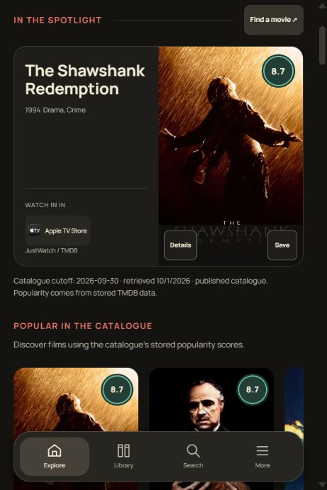

# CineMatch

[](https://github.com/AyushM1701/Movie-Recommender/actions/workflows/checks.yml)

**Find your next film, see where to watch it, and build your own movie library.**

CineMatch combines title and theme search, personalized recommendations, regional streaming availability, and private or shareable film collections. Its dark, poster-led interface works on desktop and mobile, with keyboard navigation and reduced-motion support.

The published catalog contains **56,542 searchable titles**, including **54,461 titles with recommendation features**. Its release-date cutoff is **September 30, 2026**. The live refresh covers TMDB non-adult, non-video movies across all languages and countries with primary release dates between January 1 and September 30, 2026. Historical coverage comes from the bundled sources; this does not claim every movie ever released.

## Preview



Browsing cards show **one watch option** to keep the catalog compact. Open movie details to see **all available providers**, cast, synopsis, and trailers when TMDB supplies them. India is the default watch region; the country selector changes availability throughout the app.

## Features

- Explore the complete indexed catalog with genre, decade, rating, sorting, and pagination controls, including films before 1970.
- Search by title or plot/theme. The interface distinguishes exact, partial, theme, and empty results.
- Discover similar movies, blend explicit seeds with genres, or use saved viewing history and ratings. Watched exclusions apply to the full history; dislikes influence recommendations.
- Keep a watched shelf, watchlist, private notes, ratings, and curated lists. Owners can edit private lists; public lists have a separate share route.
- Select a watch country (India by default). Browsing cards show one provider; movie details show every provider, availability timestamps, trailers, and cast.
- Watch links open TMDB regional availability pages powered by JustWatch. They are availability links, not guaranteed direct playback links.

| Recommendation mode | Input |
| --- | --- |
| Browse by genre | Selected genres with explicit rating and vote thresholds. |
| More like these | Movies chosen as visible seeds. |
| Mix & match | Recent saved history or manual seeds, combined with independently selected genres. |
| For you | Saved genres, viewing history, ratings, and dislikes. |

Movie-card scores are **TMDB community ratings**. Provider coverage varies by title and region. Titles without usable recommendation features remain searchable and browsable; unsupported manual seeds return an explicit error.

## Architecture

| Layer | Implementation |
| --- | --- |
| Frontend | HTML, CSS, vanilla JavaScript, independent request ownership per surface |
| API | FastAPI with Pydantic validation |
| Personal storage | SQLAlchemy with SQLite or PostgreSQL |
| Catalog storage | Indexed, read-only SQLite catalog |
| Recommendations | scikit-learn, SciPy, pandas, NumPy; weighted TF-IDF and LSA |
| Authentication | bcrypt password hashes and JWT session versioning |
| Live media | TMDB client with bounded concurrency, request deduplication, caches, and retries |
| Deployment | Render blueprint, Gunicorn/Uvicorn, exact dependency lock |

## Run locally

Use Python **3.13**; deployment and CI pin the patch in [`.python-version`](.python-version). Node.js **22** is needed only for frontend tests.

### Windows / PowerShell

```powershell
git clone https://github.com/AyushM1701/Movie-Recommender.git
cd Movie-Recommender
python -m venv .venv
.venv/Scripts/python -m pip install -r backend/requirements.lock
Copy-Item .env.example .env
```

Edit `.env` using the settings below, then build the model and start the server:

```powershell
.venv/Scripts/python -m backend.data_preprocessing
.venv/Scripts/python -m uvicorn backend.main:app --reload
```

### macOS / Linux

```bash
git clone https://github.com/AyushM1701/Movie-Recommender.git
cd Movie-Recommender
python3 -m venv .venv
.venv/bin/python -m pip install -r backend/requirements.lock
cp .env.example .env
# Edit .env before continuing.
.venv/bin/python -m backend.data_preprocessing
.venv/bin/python -m uvicorn backend.main:app --reload
```

Open [http://127.0.0.1:8000](http://127.0.0.1:8000). The first build fits the recommendation artifacts and may take a few minutes. **Restart the server after rebuilding** to load the new catalog/model generation.

### Environment settings

| Variable | Purpose | Default / requirement |
| --- | --- | --- |
| `CINEMATCH_SECRET_KEY` | Signs authentication tokens | Set a random key; required in production. |
| `CINEMATCH_ENVIRONMENT` | Development or production behavior | `development`; set `production` when deploying. |
| `CINEMATCH_DATABASE_URL` | Stores accounts, libraries, and lists | Local SQLite in `data/` when omitted; PostgreSQL supported. |
| `TMDB_API_KEY` | Enables live details, providers, poster lookup, and refreshes | Optional for offline use; obtain from [TMDB API settings](https://www.themoviedb.org/settings/api). |
| `CINEMATCH_ENABLE_POSTER_LOOKUP` | Enables network poster fallback | Enabled by default; set `0` for offline checks. |
| `CINEMATCH_TRUST_PROXY_HEADERS` | Uses proxy-supplied client addresses | `0`; enable only behind a trusted proxy that overwrites forwarded headers. |

Use [`.env.example`](.env.example) as a template. Password changes revoke existing sessions. Tests should use disposable databases.

The **15 MB compressed catalog seed** in `data/catalog_seed_v1.csv.gz`, with its provenance JSON, supports a clean offline build. The 650 MB raw source is optional and ignored. A TMDB key enables live details, availability, poster lookup, and refreshes; offline catalog browsing does not require it. See `.env.example`. Secrets and personal databases are ignored.

## Refresh and model publication

```powershell
.venv/Scripts/python -m backend.fetch_latest_movies --help
.venv/Scripts/python -m backend.fetch_latest_movies --start 2026-01-01 --end 2026-09-30
.venv/Scripts/python -m backend.data_preprocessing
```

The refresh CLI supports explicit start/end dates, worker counts, and request rates; consult `--help` for the arguments. Discovery walks all result pages and splits date windows when API limits or count discrepancies require it. Detail and credit requests automatically resume from checkpoints. Invalid, adult, video, and out-of-scope records are excluded with coverage evidence. Failed refreshes preserve the previous active pair.

Refreshes publish immutable paired movie/credit generations. Model builds publish a matching SQLite catalog, aligned IDs, sparse vectors, normalized semantic vectors, checksums, and a manifest. An atomic pointer activates a validated generation. The running process pins that catalog/model pair; restart after building to load it. Corrupt generations fail startup instead of silently loading unrelated files.

The September refresh discovered 34,546 IDs and published 34,520 valid movie details. Twenty-six IDs had detail metadata outside the release scope. One valid movie's credit/keyword endpoints returned 404; that missing source data is recorded. See [coverage evidence](data/catalog_refresh_2026-09-30.json).

Field weights favor plot text (1.8), then keywords (1.0), cast/director metadata (0.8), and genres (0.75). Default semantic retrieval uses reproducible 256-dimensional LSA, fitted without genre columns. Optional neural embeddings require `backend/requirements-semantic.txt` and an explicitly selected backend.

## Verification

Local verification recorded **92 backend tests: 90 passed and two PostgreSQL-only checks skipped**, plus **14 passing frontend tests**. The PostgreSQL migration cases were also exercised against a disposable PostgreSQL 17 service. Ruff, syntax checks, and dependency consistency passed. Local verification used Python 3.13.3 and Node 22.16.0.

A clean source copy with no `.env`, large raw source, personal database, or prebuilt models successfully installed locked dependencies, rebuilt the full snapshot offline, and served readiness, search, details, and catalog requests. See [clean startup evidence](docs/verification/clean-startup.json) and [verification artifacts](docs/verification/).

```powershell
.venv/Scripts/python -m pip install -r backend/requirements-dev.txt
.venv/Scripts/python -m ruff check backend
.venv/Scripts/python -m ruff format --check backend
.venv/Scripts/python -m compileall -q backend
.venv/Scripts/python -m unittest discover -s backend/tests -v
node --check frontend/assets/app.js
node --test frontend/tests/*.test.mjs
.venv/Scripts/python -m pip check
```

Tests use disposable databases and deterministic recommendation fixtures. PostgreSQL migration tests opt in through `CINEMATCH_TEST_POSTGRES_URL`, which must identify a disposable database. Windows and Ubuntu CI also rebuild artifacts offline from the compact seed.

Use [GitHub Actions](https://github.com/AyushM1701/Movie-Recommender/actions/workflows/checks.yml) for the current hosted check status.

```powershell
.venv/Scripts/python -m backend.evaluate_recommender --sample-size 50 --top-k 10 --seed 42 --compare-baselines --output docs/verification/recommender-evaluation.json
```

The evaluation labels its genre/keyword relevance measure as an **attribute proxy**, compares the same samples against genre and popularity baselines, and calculates recall against the full eligible pool. It does not measure human satisfaction. `--interactions-csv` accepts interaction data for held-out evaluation; no human interaction dataset was available for this implementation.

The [recorded comparison](docs/verification/recommender-evaluation.json) uses the same 50 samples at K=10 for every strategy:

| Attribute proxy | Hybrid | Genre baseline | Popularity baseline |
| --- | --- | --- | --- |
| NDCG@10 | 0.6695 | 0.5484 | 0.0859 |
| Precision@10 | 0.7680 | 0.7660 | 0.0500 |
| Recall@10 | 0.0078 | 0.0029 | 0.0002 |

Read [PROJECT_AUDIT.md](PROJECT_AUDIT.md), [the approved specification](docs/superpowers/specs/2026-09-30-cinematch-remediation-design.md), and [IMPLEMENTATION_STATUS.md](IMPLEMENTATION_STATUS.md) for the audit and finding-level evidence.

## API and deployment

Interactive API documentation is at `/docs` while the server is running.

| Endpoint | Purpose |
| --- | --- |
| `GET /health` | Process status and catalog statistics |
| `GET /ready` | Model, catalog, migration, and personal-schema readiness |
| `GET /catalog`, `GET /catalog/metadata` | Paginated browsing and snapshot provenance |
| `GET /search` | Title and theme discovery |
| `GET /movies/{id}/details`, `GET /movies/{id}/similar` | Movie details and related titles |
| `GET /watch/countries`, `POST /watch/options` | Regional availability |
| `POST /recommend/genre`, `/recommend/history`, `/recommend/hybrid` | Explicit recommendation modes |
| `GET /recommend/me` | Authenticated personal recommendations |
| `/auth`, `/watched`, `/watchlist`, `/lists`, `/library/export` | Accounts and collection workflows; see `/docs` for methods and contracts |

[`render.yaml`](render.yaml) uses locked runtime dependencies, an offline model build, one Gunicorn/Uvicorn worker, and `/ready`. Configure production signing, TMDB, and PostgreSQL credentials in the deployment environment. Verify the target deployment's build, migrations, readiness, and memory budget separately from local checks.

## Project layout

```text
backend/             API, persistence, recommender, refresh/build pipeline, tests
frontend/            Application markup, styles, JavaScript, behavior tests
data/                Catalog seed, supplied sources, coverage and provenance
models/              Generated catalog/model generations (ignored)
docs/verification/   Test evidence, evaluation reports, UI screenshots
.github/workflows/   Windows and Ubuntu checks
```

Movie metadata comes from TMDB. Regional watch availability is supplied by JustWatch via TMDB. Metadata and availability can change after retrieval; the app distinguishes unavailable data from an empty regional listing.
